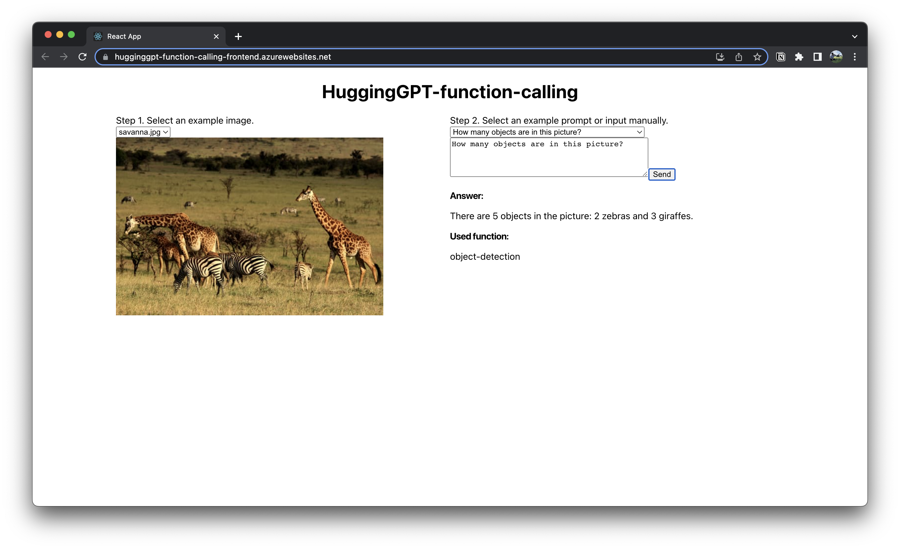

# HuggingGPT-function-calling

A web app to call various Hugging Face API with natural language by GPT function calling feature

https://hugginggpt-function-calling-frontend.azurewebsites.net/

* Frontend: React (TypeScript) hosted on Microsoft Azure App Service
* Backend: FastAPI (Python) hosted on Microsoft Azure Functions

## Overview

The idea of this project is inspired by the paper "[HuggingGPT: Solving AI Tasks with ChatGPT and its Friends in Hugging Face](https://arxiv.org/abs/2303.17580)" (GitHub page: [microsoft/JARVIS](https://github.com/microsoft/JARVIS)), which was initially published on 2023 March 30th.

But the difference is that this project utilizes the [GPT function calling feature](https://openai.com/blog/function-calling-and-other-api-updates), which was newly introduced on 2023 June 13th.

See more details in [hugging_gpt.py](./backend/app/hugging_gpt/hugging_gpt.py).

## Current available functions

* image-classification
* object-detection
* image-to-text
* visual-question-answering

See more details in [huggingface_available_functions.json](./backend/app/hugging_gpt/huggingface_available_functions.json).
